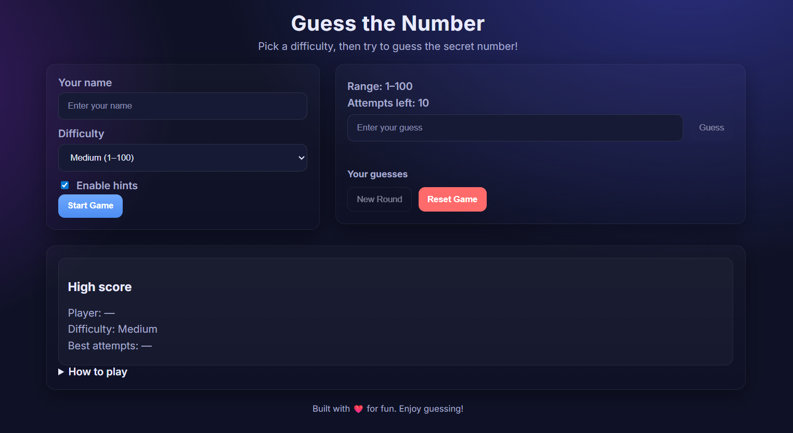

# Guess the Number

A modern, responsive number guessing game with multiple difficulties, optional hints, attempts counter, guess history, and local high scores.

## Demo & Screenshot
- Run locally using the steps below, or deploy with GitHub Pages (guide below).

## Features
- **Difficulty levels**: Easy (1–50), Medium (1–100), Hard (1–500)
- **Hints (optional)**: Higher/Lower plus proximity feedback (Hot/Warm/Cold)
- **Attempts counter** and **guess history chips**
- **Local high scores** per difficulty (player name and best attempts)
- **Keyboard-friendly** (Enter to submit) and **mobile-friendly** UI

## Quick Start
1. Download or clone this repository.
2. Open `index.html` directly in your browser, or use a local web server (recommended).

### Run with a local server (recommended)
- VS Code: install the "Live Server" extension, then "Open with Live Server" on `index.html`.
- Python: `python -m http.server` (then open `http://localhost:8000`).
- Node: `npx serve` (then open the printed URL).

## How to Play
1. Enter your name, choose a difficulty, and click Start Game.
2. Type your guess and press Guess (or press Enter).
3. Read the feedback (and optional hints) and keep guessing until you find the number.
4. Use New Round to play again with the same difficulty, or Reset Game to start fresh.

## Keyboard Shortcuts
- **Enter**: Submit current guess
- **Esc**: (If implemented) Clear input

## Tech Stack
- **HTML** for structure (`index.html`)
- **CSS** for styling (`styles.css`)
- **Vanilla JavaScript** for game logic and persistence (`script.js`)

## Project Structure
- `index.html` – App layout and UI elements
- `styles.css` – Responsive theme and components
- `script.js` – Game logic, state management, and `localStorage` high scores

## Data & Privacy
- High scores are stored locally in your browser via `localStorage`, scoped per difficulty.
- No data is sent to any server.
